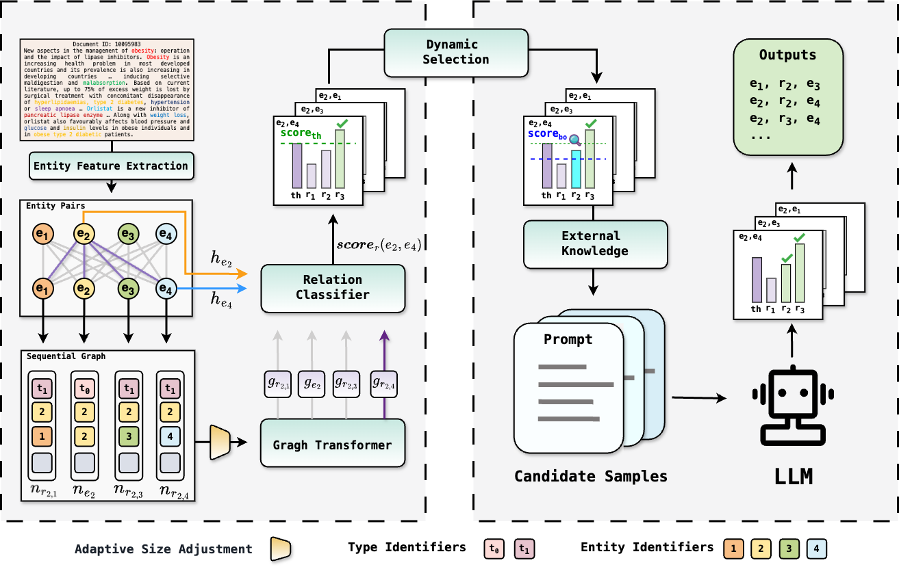

# GLiM 
Code for **GLiM: Integrating Graph Transformer and LLM for Document-Level Biomedical Relation Extraction with Incomplete Labeling**.


## Overview




## Installation

```
conda create -n ie python=3.10.15
pip install -r requirements.txt
```


## Training and inference

```
# step1 GT-RE
cd GT-RE
bash shells/run_ncdg.sh

# Before step2, start the LLM's API service via LLaMA-Factory(https://github.com/hiyouga/LLaMA-Factory).

# step2 LLM inference
cd LLM-Inference
bash shells/data_ncdg.sh
```


## Acknowledgements

This project is built upon [ATLOP](https://github.com/wzhouad/ATLOP),  [SSR-PU](https://github.com/www-Ye/SSR-PU),  [TokenGT](https://github.com/jw9730/tokengt) and [LLaMA-Factory](https://github.com/hiyouga/LLaMA-Factory). Thanks to their great contribution!
